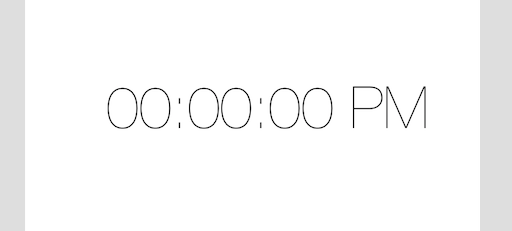
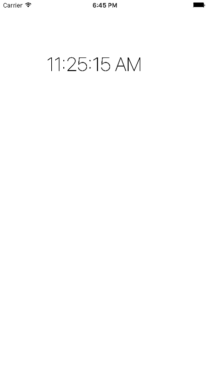
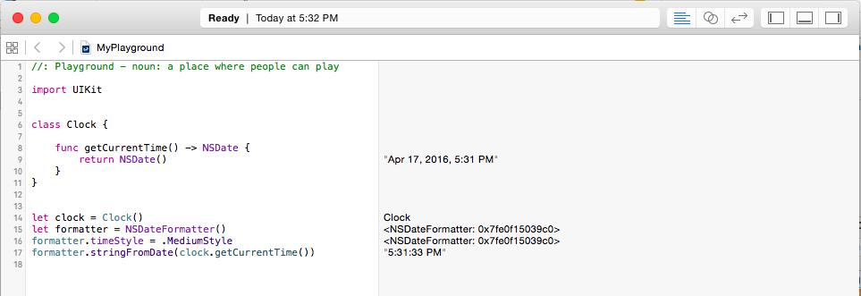

##Clock App

Completed Clock app [here](https://github.com/upperlinecode/intro-to-swift/tree/master/day-7/Clock)

###Students Will Be Able To
- Strengthen their knowledge of:
  - building UIViews
  - adding constraints to a view
  - using IBOutlets to connect view elements to controller code
- Recognize controller lifecycle events and relate them to methods such as viewDidLoad.

###Why
Adding a timing element to an app can be very useful. Most games out there have some variation of a gameplay clock. Any social networking app displays a time and date for users comments, posted pictures, and or events. Banking apps often time out after a period of time to protect users' information.

###Walkthrough
####Getting Started
- Create a one-page application in Xcode called Clock. 
- To begin, we need a label that will display the time. The initial placeholder text should be '00:00:00 PM'.
<p align="center">
  
</p>

- A clock display works very similarly to the labels we've used before in class. We've already updated the text attribute of a label from the controller. Create an IBOutlet from Main.storyboard to ViewController.swift, and call the outlet "timeLabel". Then, we can update the clock's time as the app loads, just like this:
```Swift
class ViewController: UIViewController {

    @IBOutlet weak var timeLabel: UILabel!
    
    override func viewDidLoad() {
        super.viewDidLoad()
        
        timeLabel.text = "11:25:15 AM"
    }
}
```
<p align="center">
  
</p>
- There are two obvious problems with this method of updating the clock: we are only updating the clock at the instant when the app loads, and the time is hard-coded rather than the actual time.
- We'll start with getting the accurate time. Swift has a class within UIKit called [NSDate](https://developer.apple.com/library/ios/documentation/Cocoa/Reference/Foundation/Classes/NSDate_Class/) that has methods for getting the time and date. Have the students open up a new Xcode playground and, as a class, test out the methods and properties of NSDate. You can start by making a Clock class that has a getCurrentTime method like below.

- Also experiment with the [NSDateFormatter](https://developer.apple.com/library/mac/documentation/Cocoa/Reference/Foundation/Classes/NSDateFormatter_Class/) class, which can let you display the date and time in different formats.
<p align="center">
  
</p>
- This clock class is going to be our app's model, or backend. Make a new file called clock.swift and add the clock class to it.
```Swift
//clock.swift
import Foundation
class Clock {
    func getCurrentTime() -> NSDate {
        return NSDate()
    }
}
```
- Give the ViewController access to the model by storing it in a constant. Remember that any classes we add to our model are automatically available in the controller.
```Swift
//ViewController.swift
class ViewController: UIViewController {
  let clock = Clock()
 ..
}
```
- Now, we can take the code that we used in the playground to get format the time and put it in a controller method called updateTimeLabel. This will change the text of timeLabel to the formatted current time.
```Swift
class ViewController: UIViewController {
 ...
  func updateTimeLabel() {
      let formatter = NSDateFormatter()
      formatter.timeStyle = .MediumStyle
      timeLabel.text = formatter.stringFromDate(clock.getCurrentTime())
  }
}
```
- Adding this method to the viewDidLoad method will update the view with the correct time once at the instant of the view loading.
```Swift
class ViewController: UIViewController {
 ...
  override func viewDidLoad() {
      super.viewDidLoad()
      updateTimeLabel()
  }
  ..
}
```
- Now we run into our second problem of this only working once. What we want is for our label to update once every second so the user doesn't have to reload the page every time they want an accurate time. For this, there is a class called [NSTimer](https://developer.apple.com/library/mac/documentation/Cocoa/Reference/Foundation/Classes/NSTimer_Class/) with a method called scheduledTimerWithTimeInterval that can perform actions at a designated time interval. The code for this is shown below. It takes five arguments. 
  - The first is the time interval, and we make this one second so that the time updates every second.
  - Next, we pass in the target object, which will be self. This is where things get a little confusing. The scheduledTimerWithTimeInterval method will be executing the updateTimeLabel method over and over again. The updateTimeLabel method is an instance method of the ViewController class. Therefore, the target of scheduledTimerWithTimeInterval is the current instance ViewController class. However, since we are writing this code within the ViewController class we can simplify things by just writing self. When inside an instance method in Swift, self is shorthand for instance of the class that that method belongs to. Pretty abstract stuff, and not extremely important to get into right now.
  - The selector is updateTimeLabel, which is the method that scheduledTimerWithTimeInterval will run at each time interval
  - userInfo is optional, and we can just leave that as nil.
  - finally, make repeats true so that our method will continuously repeat once per second.

```Swift
override func viewDidLoad() {
    super.viewDidLoad()
    timer = NSTimer.scheduledTimerWithTimeInterval(1.0, target: self, selector: "updateTimeLabel", userInfo: nil, repeats: true)
}
```

Completed Clock app [here](https://github.com/upperlinecode/intro-to-swift/tree/master/day-7/Clock)

####Bonus Tasks
- Add multiple clock displays, each for a different time zone.
- Improve the accuracy of your clock and display time down to the millisecond.
- Draw an analog clock to display the time. You can follow the tutorial [here](http://sketchytech.blogspot.com/2014/11/swift-how-to-draw-clock-face-using.html)

###Conclusion

