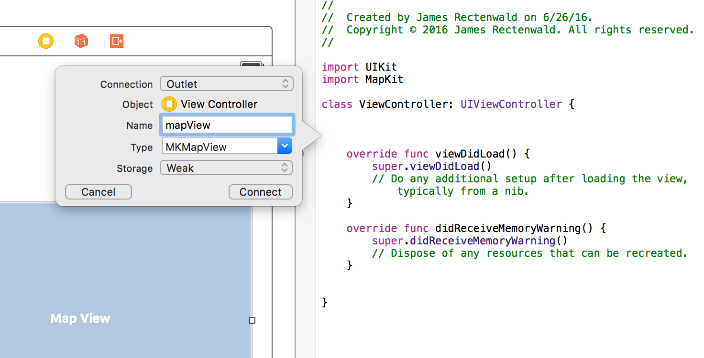
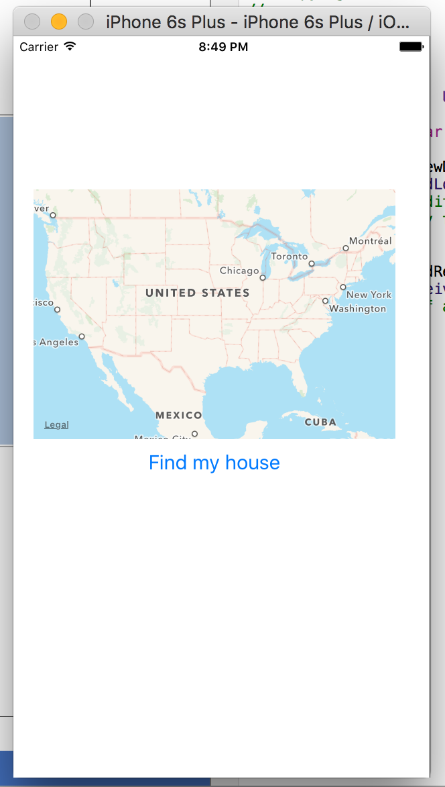

##MapKit Walkthrough

Completed map app [here]()

###Students Will Be Able To
- Embed a map directly in their app with MapKit View
- Annotate their app's map with MKAnnotationView
- Find their phone's current location in a MapKit View using CoreLocation
- Create buttons to control events in the map

###Why
Maps can be a very useful addition to your app. Also, more object-oriented programming! MapKit is a framework that uses the same patterns we've seen for UIKit; more importantly, it uses the same patterns as WebKit, SiriKit, and many more APIs you can use in your iOS apps.

###Walkthrough
####Getting Started
- Create a one-page application in Xcode.
- [MapKit](https://developer.apple.com/maps/) is another framework that isn't automatically included in your Xcode project. At the top of the ViewController file, add this line so that all of MapKit's functionality is available to us.
```Swift
import MapKit
```
- In the Object Library, find the Map Kit View object and drag it into the storyboard. 
- As with any other object that we interact with from the view controller, we need to connect the map object to the controller with an IBOutlet. Just like before, you can do this by right-clicking on the map in the storyboard and dragging the mouse into the top of the ViewController class. Name the connection mapView.
<p align="center">
  
</p>
- Next, drag a button beneath the map and change the button's text to read "Find my house". It should look something like this:
<p align="center">
  
</p>

####Setting a default map location
- Already, our you can use your fingers to zoom in/out, rotate, and scroll around the map. The next iteration of our map will center the map on a specific location when the page loads.
- We will tell the view controller where to load the map by giving a latitude and longitude. There is a class in Swift called [CLLocation](https://developer.apple.com/library/ios/documentation/CoreLocation/Reference/CLLocation_Class/index.html) that lets us create an object that holds both of these values in one instance. Find the [coordinates](http://www.latlong.net/) of your home (or somewhere else cool) and create a CLLocation constant beneath your mapView outlet.
```Swift
class ViewController: UIViewController {

    @IBOutlet weak var mapvView: MKMapView!
    let homeLocation = CLLocation(latitude: 38.897676, longitude: -77.036483)
  
  ...
}
```
- Next, we're going to add a function that will tell the map to center on a specific point on the map. This function can be called when the view loads as well as in an action connected to a button. Let's call the function centerOnLocation.
  - this method will take two parameters: a location, which will allow us to use the function to go to any location we pass in, and the mapView itself.
  - there is a MapKit function called [MKCoordinateRegionMakeWithDistance](https://developer.apple.com/library/ios/documentation/MapKit/Reference/MapKitFunctionsReference/index.html#//apple_ref/c/func/MKCoordinateRegionMakeWithDistance) that will use the CLLocation object to create a region to center on. It takes three arguments: the location object, the latitudinal meters to fit in the view, and the longitudinal meters to fit in the view.
```Swift
class ViewController: UIViewController {

  ...

  func centerOnLocation(location: CLLocation, mapView: MKMapView) {
      let coordinateRegion = MKCoordinateRegionMakeWithDistance(location.coordinate, 750, 750)
      mapView.setRegion(coordinateRegion, animated: true)
  }
}
```

- This method centerOnLocation can be called anywhere in our class in order to center the map on a specific location, as long as we pass in two arguments: an instance of the CLLocation class and our instance of MKMapView. Add it to the viewDidLoad function. Use the homeLocation and mapView instance properties for arguments. Now, the app will load on the home location that we've set.
```Swift
class ViewController: UIViewController {

  ...

  override func viewDidLoad() {
      super.viewDidLoad()
      centerOnLocation(homeLocation, mapView: mapView)
  }
```

```Swift
class ViewController: UIViewController {

  ...

  @IBAction func findMyHouse(sender: UIButton) {
      centerOnLocation(homeLocation, mapView: mapView)
  }
}
```
Completed map app [here]()
####Bonus Tasks


