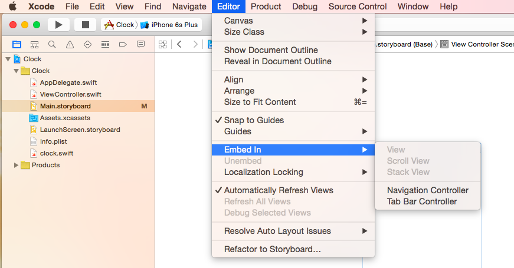
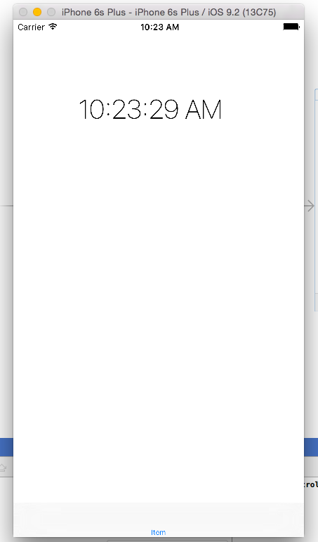
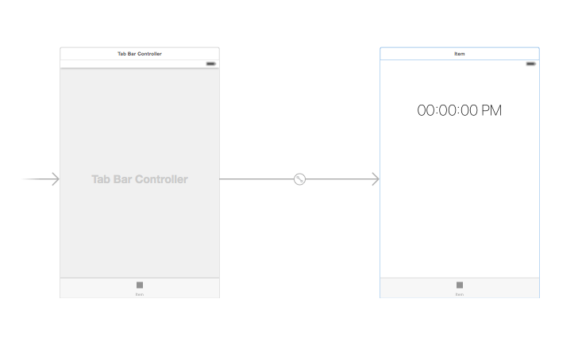
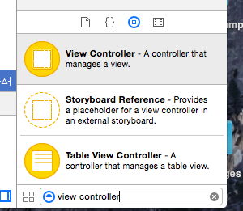
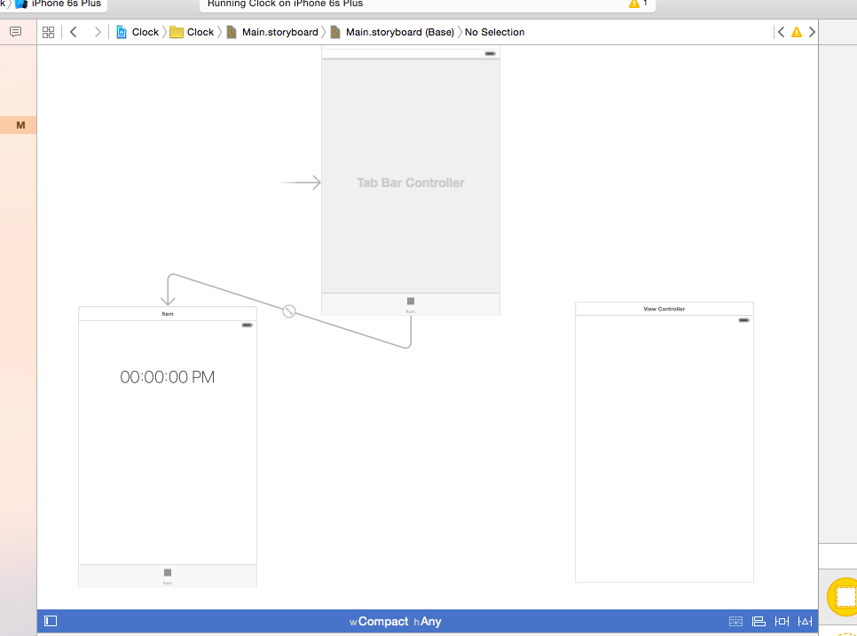
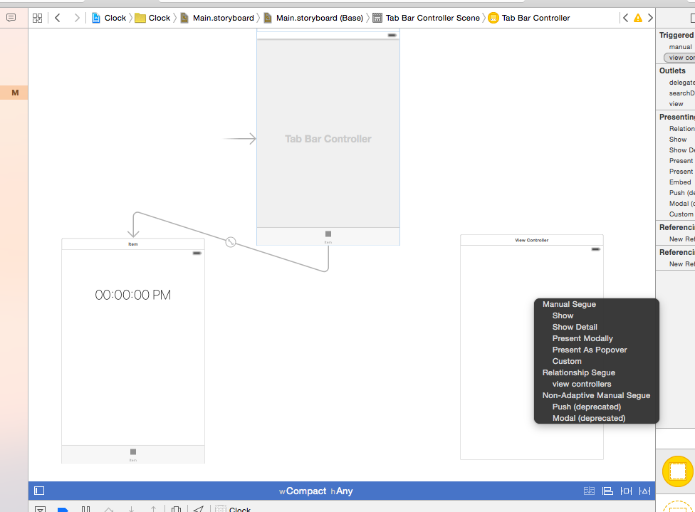
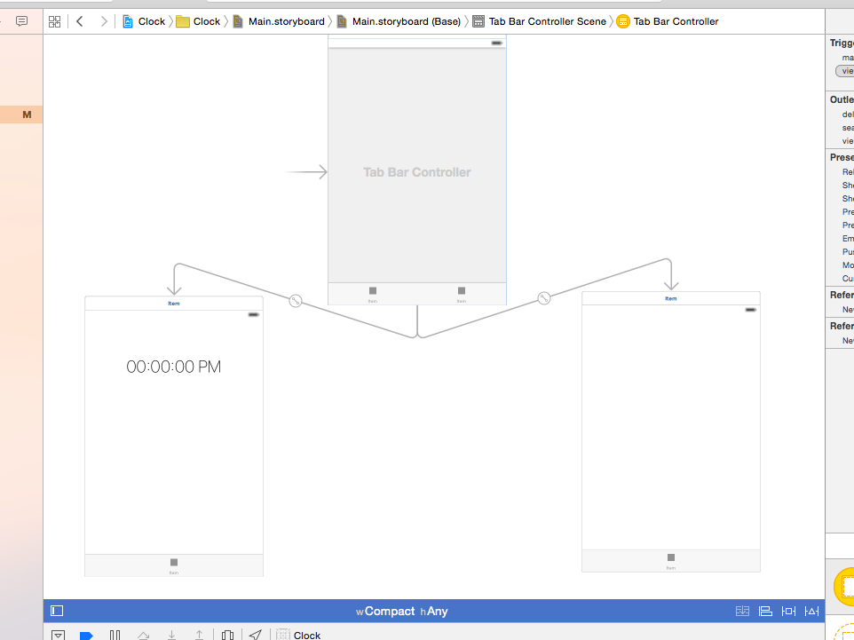

##Clock App: Stopwatch Extension

Completed App [here]()

###Students Will Be Able To
- Create a tabbed application from a single-view app. Specifically, create a tabbed application with two views: a clock and a stopwatch.
- Strengthen their knowledge of NSDate and NSTimer

###Why
Tabbed Views are very popular in iOS apps. The Clock, Music, Instagram, and iBook apps are just a few of the many popular examples. Besides being popular, they are not at all difficult to implement.

###Walkthrough
####Getting Started
- While a tabbed application is one of the options available when you create a new Xcode project, you can also transform an already-made single-view app into a tabbed view app very easily.
- Open up your clock app and go to Main.storyboard. You should see your clock page with the time label at the top. Click on the clock page, go to the editor dropdown in the menu, and select Embed In -> Tab Bar Controller. This will create a tab bar controller that points to our clock page. If you run the app, it will show the same clock page, but now there is one tab at the bottom.
<p align="center">
  
  
</p>
Main.storyboard:
<p align="center">
  
</p>
- In order to add another tab, go to the object library and search for view controller. Drag the new view controller object onto your storyboard and arrange it next to the tab controller and the clock page.
<p align="center">
  
  
</p>
- Holding down the control button, click and drag from the tab controller to the new view controller. When the popup menu appears, select Relationship Segue -> View Controllers.
<p align="center">
  
  
</p>
- Now that we have two scenes in our storyboard, it is good practice to create two separate controllers for the scenes. Here's how to do that:
  - Add a new swift file to the project and name it StopwatchViewController. Copy and paste the following boilerplate controller code into the new file
    ```Swift
    import UIKit

    class StopwatchViewController: UIViewController {
      override func viewDidLoad() {
          super.viewDidLoad()
      }
    }
    ```
  - Rename the ViewController file ClockViewController. Go into the file and also change the name of the class to ClockViewController.
  - Connect each scene to their respective controller. You can do this by clicking on the scene in the storyboard, going to the identity inspector on the right, and selecting the appropriate view controller class in the Class dropdown field.

Completed App [here]()

####Bonus Tasks


